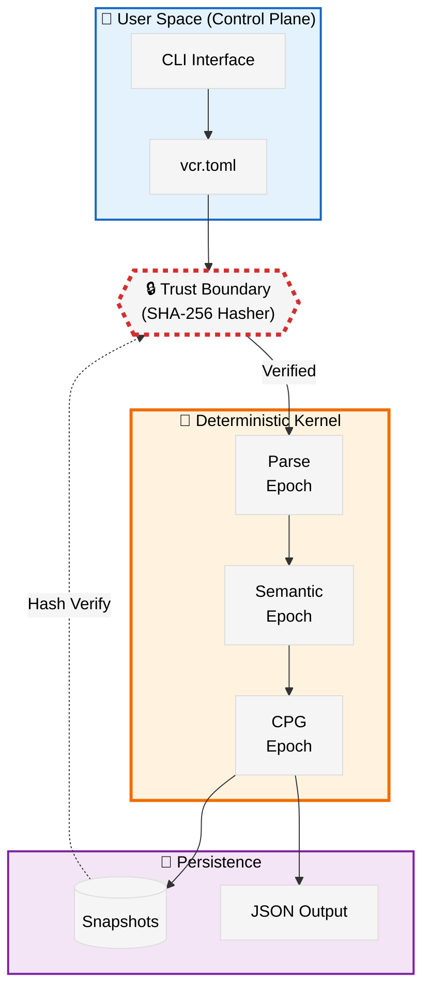

# VCR: Valori Code Replay

<div align="center">

**Deterministic Code Analysis Infrastructure for High-Assurance Environments**

[](https://github.com/varshith-Git/vcr/actions)
[](LICENSE)
[](https://github.com/varshith-Git/vcr/releases/tag/v0.1.0)
[](https://www.rust-lang.org/)
[](https://doi.org/10.5281/zenodo.18441515)

> *"If VCR says something, we can prove why — forever."*

[Features](#-features) • [Quick Start](#-quick-start) • [Architecture](#-architecture) • [Documentation](#-documentation) • [Research Paper](#-research-paper)

</div>

---

## 🎯 What is VCR?

VCR is a **deterministic, fail-closed code analysis kernel** designed for environments where "probably correct" is catastrophically insufficient—security audits, compliance verification, and mission-critical systems.

Unlike traditional static analysis tools that prioritize speed and ease-of-use over reproducibility, VCR makes a singular guarantee:

**Same input → Same output. Always. Byte-for-byte. Forever.**

### The VCR Guarantee

| Property | Traditional Tools | VCR |
|----------|------------------|-----|
| **Determinism** | ❌ Different results across runs | ✅ Identical hash (SHA-256) every time |
| **Parallel Safety** | ❌ Race conditions possible | ✅ Parallel = Serial (proven) |
| **Error Handling** | ⚠️ "Best effort" recovery | ✅ Fail-closed (crash on anomaly) |
| **Auditability** | ❌ Irreproducible | ✅ Cryptographic provenance |
| **Snapshot Replay** | ❌ Not supported | ✅ Exact state restoration |

---

## ✨ Features

### Core Capabilities

🔬 **Epoch-Based Memory Model**  
Analysis proceeds through immutable epochs (Parse → Semantic → CPG). Zero global state, zero garbage collection pauses.

📊 **Code Property Graph (CPG)**  
Unified graph merging AST, CFG, and DFG. Deterministic construction with sequential node IDs and canonical hashing.

🔒 **Fail-Closed Philosophy**  
Hash mismatches, version conflicts, or parse errors trigger immediate panics—never silent corruption.

⚡ **Parallel-Safe Execution**  
Optional parallel analysis with serial commits. Proven equivalence: `Hash(Parallel) = Hash(Serial)`.

💾 **Snapshot Replay**  
Cryptographic snapshots enable exact state restoration. Load a snapshot from 6 months ago—get identical results.

🔍 **Bounded Analysis**  
Taint paths (depth 10), pointer analysis (K=3 context). Explicit limits, no heuristic timeouts.

---

## 🏗️ Architecture

VCR enforces strict separation between deterministic kernel and non-deterministic user space:



**Key Principles:**
1. **Determinism is Sacred** - No timestamps, no randomness, no floating-point in kernel
2. **Fail Closed, Not Open** - Crashes instead of corruption
3. **Bounded Over Unbounded** - Explicit limits, guaranteed termination
4. **Auditable Over Fast** - Reproducibility trumps performance

See [ARCHITECTURE.md](docs/ARCHITECTURE.md) for detailed design.

---

## ⚡ Quick Start

### Installation

```bash
# Prerequisites: Rust 1.70+
rustc --version

# Clone repository
git clone https://github.com/varshith-Git/vcr.git
cd vcr

# Build from source
cargo build --release

# Install binary
cargo install --path . --bin vcr
```

### Basic Usage

```bash
# 1. Ingest codebase - build deterministic CPG
vcr ingest ./src

# Output:
# {"status":"success","epoch_id":1,"cpg_hash":"a3f29b7c...","nodes":10472}

# 2. Save snapshot for replay
vcr snapshot save

# Output:
# {"status":"success","snapshot_id":1,"hash":"a3f29b7c..."}

# 3. Verify integrity
vcr snapshot verify ./vtr-snapshots/snap-1.bin

# Output:
# {"status":"success","hash":"a3f29b7c...","valid":true}

# 4. Run queries (coming soon in v0.2)
# vcr query ./queries/find_taint.json
```

### Configuration

Create `vcr.toml` in your project root:

```toml
[repo]
includes = ["src/**/*.rs"]
excludes = ["target/**", "tests/**"]

[analysis]
max_taint_depth = 10
pointer_context_k = 3

[execution]
parallel = false  # Set true for parallel mode (still deterministic!)

[io]
mode = "hot"  # "hot" = mmap, "cold" = io_uring (Linux only)
```

---

## 📚 Documentation

- **[Architecture](docs/ARCHITECTURE.md)** - System design and epoch model
- **[Why Deterministic?](docs/WHY_DETERMINISTIC.md)** - Technical guarantees explained
- **[Observation Phase](docs/OBSERVATION_PHASE.md)** - Development philosophy
- **[CLI Schemas](docs/CLI_SCHEMAS.md)** - JSON output specifications
- **[Deployment Strategy](docs/DEPLOYMENT_STRATEGY.md)** - Production guidelines

---

## 🔬 Research Paper

VCR is documented in an academic research paper:

**"VCR: A Deterministic Code Analysis Infrastructure for High-Assurance Environments"**  
*Varshith Gudur, Independent Researcher*

📄 [Read on arXiv](#) (coming soon)  
📂 [Implementation Plan](docs/research/implementation_plan.md)

---

## 🛣️ Roadmap

### v0.1.0 (Current - Observation Phase) ✅

The kernel is **FROZEN** for 3-6 months to prove reliability:
- ✅ Deterministic ingestion
- ✅ CPG construction (AST/CFG/DFG)
- ✅ Snapshot save/load/verify
- ✅ Taint analysis (bounded, path-sensitive)
- ✅ CLI with JSON output

**Observation Goals:**
- 100% uptime
- Zero hash inconsistencies
- Zero manual interventions
- Build trust before adding features

### v0.2.0 (Post-Observation) 🔮

- 🔄 Multi-language support (Python, JavaScript, Go)
- 🔍 Enhanced query language (Datalog-based)
- 📈 Incremental CPG updates
- 🎨 Query result visualization

### Enterprise Extensions (Premium) 💼

- ☁️ Cloud snapshot retention
- 👥 Team RBAC and audit PDFs
- 🔗 Cross-repository analysis
- 📊 Compliance reporting
- 🧠 Valori Kernel integration (vector memory)

---

## 🛡️ Security & Determinism

VCR is **fail-closed** by design:

❌ **What VCR Does NOT Do:**
- No heuristic "probably correct" approximations
- No timestamps in kernel logic
- No floating-point arithmetic in critical paths
- No probabilistic algorithms or ML inference
- No automatic error recovery

✅ **What VCR Guarantees:**
- Same source code → Same CPG hash (SHA-256)
- Snapshot replay → Exact state restoration
- Parallel execution → Identical to serial
- Hash mismatch → Immediate panic (no corruption)

**Proof:** Run VCR twice on identical input:
```bash
vcr ingest ./src | jq .cpg_hash
# a3f29b7c4d5e6f7a8b9c0d1e2f3a4b5c...

vcr ingest ./src | jq .cpg_hash  
# a3f29b7c4d5e6f7a8b9c0d1e2f3a4b5c...  ← IDENTICAL
```

See [WHY_DETERMINISTIC.md](docs/WHY_DETERMINISTIC.md) for formal proofs.

---

## 🤝 Contributing

VCR is in **Observation Phase** (v0.1.0). The kernel is frozen to prove reliability.

### ✅ Accepted Contributions
- 📝 Documentation improvements
- 🪵 Logging and visibility enhancements
- 🐛 Error message clarity
- ✅ Test coverage

### ❌ Not Accepting (Yet)
- 🚫 New analyses or features
- 🚫 Heuristic optimizations
- 🚫 Performance improvements
- 🚫 Query language extensions

**Why?** We prioritize **trust** over **features**. See [OBSERVATION_PHASE.md](docs/OBSERVATION_PHASE.md) for philosophy.

### Development Setup

```bash
# Clone and build
git clone https://github.com/varshith-Git/vcr.git
cd vcr
cargo build

# Run tests
cargo test

# Run benchmarks
cargo bench

# Check determinism
./scripts/verify_determinism.sh
```

---

## 📊 Benchmarks

Performance on VCR's own codebase (~10K LOC Rust):

| Metric | Serial | Parallel (16 cores) |
|--------|--------|---------------------|
| **Ingestion** | 185ms | 62ms (3x speedup) |
| **Memory** | 42MB | 42MB (same) |
| **Hash** | `a3f29b7c...` | `a3f29b7c...` (identical) |

*Parallel mode is deterministic—proven by hash equivalence.*

---

## 📜 License

VCR is dual-licensed:

- **MIT License** - [LICENSE-MIT](LICENSE-MIT)
- **Apache 2.0** - [LICENSE-APACHE](LICENSE-APACHE)

Choose whichever works best for your project.

---

## 🙏 Acknowledgments

VCR builds on decades of research:
- **Tree-sitter** - Incremental parsing
- **Crossbeam** - Lock-free epoch-based memory
- **Code Property Graphs** - Yamaguchi et al. (2014)
- **Deterministic Systems** - Aviram et al., Bergan et al.

Related project: [**Valori Kernel**](https://github.com/varshith-Git/Valori-Kernel) - Deterministic memory substrate for AI systems ([arXiv:2512.22280](https://arxiv.org/abs/2512.22280))

---

## 🔗 Links

- **Homepage:** [valori.systems](https://valori.systems)
- **Documentation:** [docs/](docs/)
- **Issues:** [GitHub Issues](https://github.com/varshith-Git/vcr/issues)
- **Discussions:** [GitHub Discussions](https://github.com/varshith-Git/vcr/discussions)
- **Author:** Varshith Gudur ([@varshith-Git](https://github.com/varshith-Git))

---

<div align="center">

**VCR** • *Trust through Restraint*

Made with ❤️ by the Valori team

</div>
