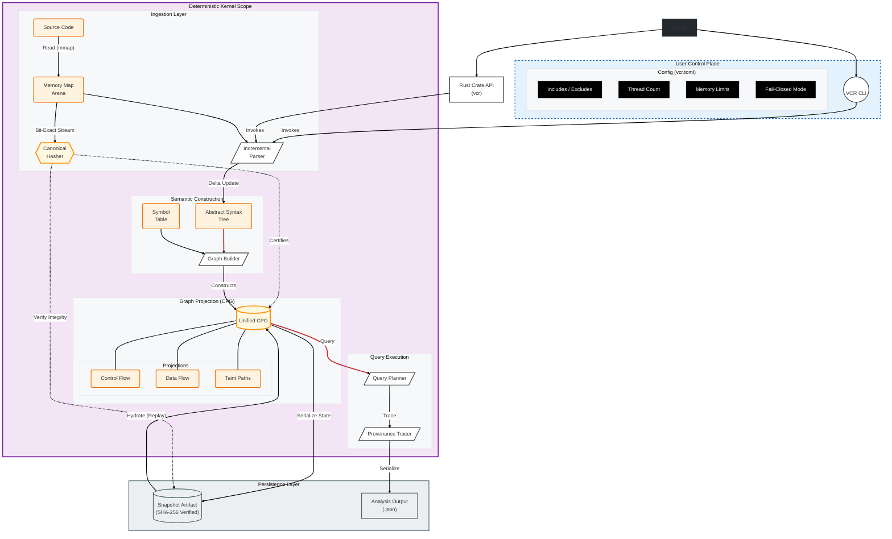

# VCR Architecture

**Abstract**
Valori Code Replay (VCR) is a deterministic, fail-closed static analysis kernel designed for high-assurance environments. This document outlines the system architecture, formally defining the separation between the User Space control plane and the Kernel Space data plane. The system prioritizes provenance and reproducibility over heuristic optimization.

## 1. System Topology

The architecture is strictly layered to enforce determinism boundaries.

## 2. Component Formalism

### 2.1 The Trust Boundary
The system enforces a strict boundary between "Inputs" (potentially untrusted) and the "Unified CPG" (proven trusted).
*   **Canonical Hasher**: Serves as the distinct cryptographic gatekeeper. It computes `H(input)`.
*   **Fail-Closed Logic**: If any semantic construction results in a state $S$ such that $H(S) \neq H(input)$, the kernel panics immediately. This prevents "silent corruption".

### 2.2 Semantic Projections
The CPG is not a single graph but a unified projection of three mathematical structures:
1.  **AST ($T$)**: The hierarchical syntactic structure.
2.  **CFG ($G_c$)**: The directed graph of execution flow where edge $(u,v)$ implies control transfer.
3.  **DFG ($G_d$)**: The flow of data values, essential for Taint Analysis.

### 2.3 Persistence & Replayability
*   **Snapshots**: Are **isomorphic** to the in-memory state.
*   **Replay**: The operation `Load(Snapshot)` is guaranteed to yield a memory state identical to the original analysis epoch, preserving $O(1)$ query determinism over time.
