# VCR Architecture

This document details the internal architecture of **Valori Code Replay (VCR)**, emphasizing its deterministic kernel and fail-closed design.

```mermaid
%%{init: {'theme': 'base', 'themeVariables': { 'primaryColor': '#202020', 'edgeLabelBackground':'#ffffff', 'tertiaryColor': '#fff'}}}%%

graph TD
    %% Styling
    classDef input fill:#e1f5fe,stroke:#01579b,stroke-width:2px;
    classDef cli fill:#fff3e0,stroke:#e65100,stroke-width:2px;
    classDef kernel fill:#f3e5f5,stroke:#4a148c,stroke-width:4px;
    classDef memory fill:#e8f5e9,stroke:#1b5e20,stroke-width:2px;
    classDef storage fill:#eceff1,stroke:#37474f,stroke-width:2px;
    classDef analysis fill:#ffebee,stroke:#b71c1c,stroke-width:2px;

    subgraph User["User Space"]
        Code[("Source Code<br/>(File System)")]:::input
        Config["vcr.toml"]:::input
        CLI["VCR CLI (vcr)"]:::cli
    end

    subgraph Kernel["VCR Kernel (Deterministic Core)"]
        direction TB
        
        %% Ingestion Phase
        subgraph Ingest["Phase 1: Ingestion"]
            Parser["Incremental Parser<br/>(Tree-sitter)"]:::kernel
            Hasher["Canonical Hasher<br/>(SHA-256)"]:::kernel
        end

        %% Semantic Phase
        subgraph Semantic["Phase 2: Semantic (In-Memory)"]
            AST["Abstract Syntax Tree<br/>(AST)"]:::memory
            SymTable["Symbol Table<br/>(Defs/Refs)"]:::memory
            Builder["Graph Builder"]:::kernel
        end

        %% Graph Phase
        subgraph CPG["Phase 3: Code Property Graph"]
            UnifiedGraph[("Unified CPG")]:::kernel
            
            subgraph Layers
                CFG["Control Flow (CFG)"]:::analysis
                DFG["Data Flow (DFG)"]:::analysis
                Taint["Taint Paths"]:::analysis
            end
        end

        %% Execution Phase
        subgraph Exec["Phase 4: Execution"]
            Plan["Query Planner"]:::kernel
            Explain["Provenance Tracer"]:::kernel
        end
    end

    subgraph Artifacts["Storage & Outputs"]
        Snapshot[("Snapshot<br/>(.bin)")]:::storage
        JSON["Analysis Result<br/>(.json)"]:::storage
    end

    %% Flows
    Code -->|"Read (mmap)"| Parser
    Code -->|"Hash Content"| Hasher
    Config --> CLI

    CLI -->|"Command (ingest)"| Parser
    
    Parser -->|"Update / Reuse"| AST
    Parser -->|"Cache Hit"| Hasher

    AST --> Builder
    SymTable --> Builder

    Builder -->|"Construct"| UnifiedGraph
    UnifiedGraph --- CFG
    UnifiedGraph --- DFG
    UnifiedGraph --- Taint

    UnifiedGraph -->|"Save"| Snapshot
    Snapshot -->|"Load (Replay)"| UnifiedGraph

    UnifiedGraph -->|"Query"| Plan
    Plan -->|"Trace"| Explain
    Explain -->|"Serialize"| JSON

    %% Legend / Validation
    Hasher -.->|"Verify"| UnifiedGraph
    Hasher -.->|"Verify"| Snapshot

    linkStyle default stroke-width:2px,fill:none,stroke:black;
```

## System Components

### 1. Ingestion Layer (Blue)
Responsible for getting code into memory deterministically.
- **Incremental Parser**: Uses `tree-sitter` to parse files. If a file hasn't changed (mtime + content hash), key structures are reused from previous epochs.
- **Canonical Hasher**: The "Source of Truth". Every byte of input is hashed. If this hash does not match the output hash, the system crashes (Fail-Closed).

### 2. The Kernel (Purple)
The brain of VCR. It operates in **Epochs**.
- **Memory Arena**: Code is allocated in arenas that are reset per epoch. No GC pauses.
- **Graph Builder**: transforms the raw AST into the CPG.
- **Fail-Closed**: Any logic error or potential non-determinism (e.g., iterating a HashMap) triggers a panic.

### 3. The Code Property Graph (CPG)
The central data structure.
- **AST**: Hierarchy (File -> Class -> Method).
- **CFG**: Execution flow (If -> Then -> Else).
- **DFG**: Variable flow (Data -> Var A -> Var B).
- **Taint**: Security paths (Source -> Sink).

### 4. Storage & Replay (Grey)
- **Snapshots**: The CPG can be serialized to disk. This is a binary dump of the memory arenas.
- **Replay**: Loading a snapshot restores the *exact* memory state of the kernel, allowing queries to be run years later with bit-perfect accuracy.
