# VCR Architecture - Improved Diagram for Research Paper

This document contains simplified, paper-friendly versions of the VCR architecture diagram.

## Version 1: High-Level System Overview (Recommended for Paper)

This version emphasizes the three-layer architecture and trust boundary.

**Key Improvements:**
- Clear separation of three layers
- Trust boundary explicitly shown
- Epoch flow is obvious (E1 → E2 → E3)
- Reduced visual clutter
- Grayscale-friendly colors

---

## Version 2: Detailed Data Flow (For Technical Readers)

This version shows more implementation details while maintaining clarity.

**Use this for:**
- Technical appendix
- Detailed implementation discussion

---

## Version 3: Epoch Pipeline (Simplest - Great for Abstract/Intro)

**Use this for:**
- Paper introduction
- Quick concept explanation
- Presentations

---

## Version 4: Parallel Execution Model (For Implementation Section)

```mermaid
%%{init: {'theme': 'base'}}%%

graph TD
    classDef task fill:#e1f5fe,stroke:#0277bd,stroke-width:2px
    classDef compute fill:#fff9c4,stroke:#f57c00,stroke-width:2px
    classDef commit fill:#e8f5e9,stroke:#2e7d32,stroke-width:2px
    
    Plan[Execution Plan<br/>Sequential Task IDs]
    
    subgraph Parallel["⚡ Parallel Compute Phase"]
        T1[Task 1]:::task
        T2[Task 2]:::task
        T3[Task 3]:::task
        TN[Task N]:::task
    end
    
    Buffer[Result Buffer<br/>Unsorted]:::compute
    
    Sort[Sort by Task ID]:::commit
    
    subgraph Serial["🔒 Serial Commit Phase"]
        C1[Commit 1]:::commit
        C2[Commit 2]:::commit
        C3[Commit 3]:::commit
    end
    
    CPG[(CPG<br/>Deterministic)]
    
    Plan --> T1 & T2 & T3 & TN
    T1 & T2 & T3 & TN --> Buffer
    Buffer --> Sort
    Sort --> C1
    C1 --> C2
    C2 --> C3
    C3 --> CPG
```

**Use this for:**
- Explaining parallel ≡ serial theorem
- Implementation section of paper

---

## Recommendation for Your Paper

**For the main architecture section (Section 4), use Version 1** - it's clean, professional, and emphasizes the key architectural principles without overwhelming detail.

**For the implementation section (Section 5), add Version 4** - it shows how you achieve deterministic parallelism.

**For the introduction or abstract**, consider using **Version 3** - it's the simplest and gives readers an immediate understanding of the epoch pipeline.

Would you like me to:
1. Update your ARCHITECTURE.md with one of these improved versions?
2. Create a standalone diagram file for the paper?
3. Export these as images (PNG/PDF) for direct use in LaTeX?
